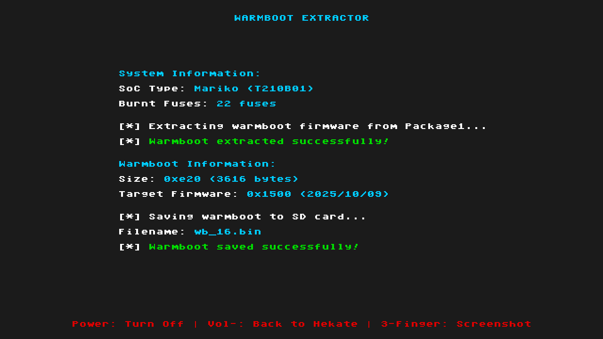

# Warmboot Extractor

<p align="center">
  
</p>

A Nintendo Switch payload tool to extract warmboot firmware from Package1 and save it to SD card.

**Mariko Consoles Only**: This tool is exclusively for Mariko (V2, Lite, OLED) consoles. Erista consoles use an embedded warmboot binary and do not require extraction.

## Overview

This tool extracts the warmboot firmware from your Mariko Switch's Package1 (stored in BOOT0) and saves it to the SD card as cache files used by Atmosphère. Mariko consoles (Switch V2, Lite, and OLED) require separate warmboot firmware files for each fuse count.

## When to Use This Tool

This tool is essential when:
- **SysMMC/OFW Updated**: Your system firmware (SysMMC) or OFW is updated to the latest firmware, burning console fuses
- **Atmosphere Out of Date**: At that time, Atmosphere needs an update from the developer but hasn't been released yet
- **eMMC Warmboot Error**: Your eMMC encounters the error: `Failed to match warm boot with fuses!`
- **Sleep Mode Broken**: Continuing without this tool causes eMMC to lose sleep mode functionality
- **Bridging the Gap**: Extract warmboot from SysMMC/OFW and use it in eMMC to resolve the mismatch and continue using eMMC without waiting for an Atmosphere update

### Important Note

**This tool is NOT needed once new Atmosphère is released!**

- Atmosphère release timing varies and **cannot be predicted** (no ETA)
- New Atmosphère automatically extracts and caches warmboot using the same logic this tool uses
- **Use this tool only as a temporary solution** while waiting for the official Atmosphère update
- Once you update to the latest Atmosphère, it will handle warmboot caching automatically

**When to use this tool:**
- You updated sysNAND and need sleep mode on emuMMC immediately
- Official Atmosphère update hasn't been released yet
- You want to continue using emuMMC without waiting

**When NOT to use this tool:**
- New Atmosphère version is already available - just update Atmosphère instead
- You can wait a few days for the official release
- You don't use sleep mode on emuMMC

## Features

- **SoC Detection**: Automatically detects Mariko (T210B01) or Erista (T210) hardware
- **Mariko-Specific Extraction**: Extracts warmboot from Package1 on Mariko consoles
- **Erista Skip**: Skips extraction on Erista consoles (uses embedded warmboot)
- **Package1 Parsing**: Automatically locates and parses PK11 container from BOOT0
- **Fuse Count Display**: Shows burnt fuse count from ODM6/ODM7 registers

## How It Works

### Mariko Warmboot Extraction:
The tool extracts warmboot from Package1 and creates a cache file **used by Atmosphère**:
1. Initializes hardware and display in horizontal mode (1280x720)
2. Detects SoC type (Mariko T210B01 or Erista T210)
3. Displays system information (SoC type and burnt fuse count)
4. For Mariko consoles:
   - Reads Package1 from BOOT0 at offset 0x100000
   - Locates and parses the PK11 container (offset 0x4000 or 0x7000)
   - Extracts warmboot firmware (validated 0x800-0x1000 bytes)
   - Reads burnt fuse count from ODM6/ODM7 fuse registers
   - Displays target firmware version from Package1 metadata
   - Saves to `sd:/warmboot_mariko/wb_XX.bin` based on burnt fuse count
5. For Erista consoles:
   - Displays message that extraction is not needed
   - Skips extraction (Atmosphère uses embedded warmboot)
6. Shows result status with color-coded messages
7. Waits for user input (Power off, Vol- for Hekate, or 3-finger screenshot)

**Filename format**: `wb_XX.bin` where XX = burnt fuse count in lowercase hex
- Example: 8 burnt fuses → `wb_08.bin`
- Example: 22 burnt fuses → `wb_16.bin` (0x16 = 22 decimal)
- Example: 31 burnt fuses → `wb_1f.bin`

**Note**: This tool uses **burnt fuses** for naming (not expected fuses). This ensures Atmosphère finds the cache file when searching for compatible warmboot on downgraded systems.

## Package1 Structure

```
Package1 (BOOT0 @ 0x100000, 256KB):
├── Stage1 (Encrypted)
└── PK11 Container (@ 0x4000 or 0x7000)
    ├── Magic: "PK11"
    ├── Payload 0: NX Bootloader (sig: 0xD5034FDF)
    ├── Payload 1: Secure Monitor (sig: 0xE328F0C0 or 0xF0C0A7F0)
    └── Warmboot Firmware ← Extracted here
        ├── Size: 0x800-0x1000 bytes (2-4KB)
        ├── Metadata: "WBT0" magic
        └── ARM7TDMI code
```

## Building

### Prerequisites
- devkitARM installed and configured
- `DEVKITARM` environment variable set
- Git (for cloning the repository)

### Clone and Build

```bash
# Clone the repository
git clone https://github.com/sthetix/Warmboot-Extractor.git
cd Warmboot-Extractor

# Build
make
```

This will:
1. Compile source files
2. Build tools (lz77 compressor, bin2c converter)
3. Create compressed payload
4. Generate loader binary

### Build Output

```
output/Warmboot_Extractor.bin       # Final payload for Hekate/injector 

```

The `output/Warmboot_Extractor.bin` file is the payload you copy to your SD card.

## Usage

### Quick Start

1. **Copy payload to SD card**:
   ```
   sd:/bootloader/payloads/Warmboot_Extractor.bin
   ```

2. **Launch from Hekate** or your preferred payload injector

3. **View extraction status** 

4. **Interact with the payload**:
   - Power button: Turn off console
   - Vol- button: Return to Hekate
   - Three-finger touch: Take screenshot (saved to SD card)

5. **Check SD card** for extracted warmboot cache files:
   - Location: `sd:/warmboot_mariko/`
   - Files: `wb_XX.bin` where XX = fuse count in lowercase hex

### Detailed Usage Scenario

**Example: Firmware 21.x.x → 22.0.0**

**Before update:**
- sysNAND: 21.0.0 (21 fuses burnt)
- emuMMC: 19.0.0 (old Atmosphère 1.7.0)
- Sleep works fine on emuMMC

**After sysNAND update to 22.0.0:**
- sysNAND: 22.0.0 (22 fuses burnt)
- emuMMC: Still 19.0.0
- Sleep broken - no warmboot cache for fuse count 22

**Solution:**

1. **Extract warmboot immediately**:
   ```
   Launch: Hekate → Payloads → warmboot_extractor.bin
   ```

2. **Tool output**:
   ```
   WARMBOOT EXTRACTOR

   System Information:
       SoC Type: Mariko (T210B01)
       Burnt Fuses: 22 fuses

   [*] Extracting warmboot firmware from Package1...
   [*] Warmboot extracted successfully!

   Warmboot Information:
       Size: 0xE80 (3712 bytes)
       Target Firmware: 0x1600 (2024/10/15)

   [*] Saving warmboot to SD card...
       Filename: wb_16.bin
   [*] Warmboot saved successfully!

   Power: Turn Off | Vol-: Back to Hekate | 3-Finger: Screenshot
   ```

3. **Boot emuMMC with old Atmosphère**:
   - Old Atmosphère looks for warmboot cache
   - Finds `wb_16.bin` (22 fuses = 0x16 hex)
   - Sleep mode works!

### Why This Works

**Atmosphère's Warmboot Caching Logic:**

When Atmosphère detects a fuse count mismatch (burnt fuses > expected fuses), it searches for cached warmboot files:

```cpp
// If burnt fuses > expected, search cache for compatible version
if (burnt_fuses > expected_fuses) {
    for (u32 attempt = burnt_fuses; attempt <= 32; ++attempt) {
        UpdateWarmbootPath(attempt);  // Try wb_16.bin, wb_17.bin, etc.
        if (TryLoadCachedWarmboot(warmboot_path)) {
            break;  // Found compatible warmboot!
        }
    }
}
```

**The key insight**: Atmosphère will use a cached warmboot if:
- Burnt fuses (22) > firmware's expected fuses (19)
- Cached warmboot exists for **burnt fuse count** (not expected fuses)
- This tool pre-populates that cache using the **current burnt fuse count**
- Naming by burnt fuses ensures the file is found during Atmosphère's search loop

### Troubleshooting

**"Failed to extract warmboot"**
- **Cause**: Unable to access BOOT0 or corrupted Package1
- **Fix**: Ensure Switch is on and not in low battery state
- **Note**: Tool displays error code and detailed error message

**"Failed to save warmboot to SD"**
- **Cause**: SD card read-only, full, or not properly mounted
- **Fix**: Check SD card, ensure write permissions and sufficient space

**"Erista detected - warmboot is embedded in Atmosphere"**
- **Cause**: Running on Erista (T210) console
- **Note**: This is expected behavior - Erista consoles do not need extraction

**Sleep still broken after extraction**
- **Cause**: Atmosphère incompatibility beyond warmboot
- **Fix**: Wait for official Atmosphère update

**Tool shows "Unknown (new FW?)" for firmware**
- **Cause**: Firmware version not in database
- **Note**: Extraction still works - burnt fuse count is used for naming

### What This Tool Does NOT Fix

**Does not bypass incompatibilities:**
- If new firmware changes SMMU, memory layout, or kernel ABI
- Old Atmosphère may still fail to boot or crash
- Warmboot cache only fixes sleep mode

**Does not extract from emuMMC BOOT0:**
- Tool reads from sysNAND BOOT0 (where new firmware is)
- This is intentional - you want warmboot from NEW firmware
- emuMMC's old BOOT0 has old warmboot (which doesn't work with new fuse count)

**Does fix:**
- Sleep mode on emuMMC with old Atmosphère after sysNAND update
- Eliminates waiting for Atmosphère devs just for warmboot cache
- Provides immediate solution while waiting for official Atmosphère release

## Display Information

The tool displays comprehensive information during extraction:

### System Information
- **SoC Type**: Mariko (T210B01) or Erista (T210)
- **Burnt Fuses**: Current fuse count read from ODM6/ODM7 registers

### Warmboot Information (Mariko only)
- **Size**: Binary size in hex and decimal (e.g., 0xE80 / 3712 bytes)
- **Target Firmware**: Version code and Package1 build date (e.g., 0x1600 YYYY/MM/DD)
- **Filename**: Output filename based on burnt fuses (e.g., wb_16.bin)

### Status Messages
- Color-coded messages indicate success (green), errors (red), or warnings (orange)
- Progress updates show each step of the extraction process
- Error codes and detailed descriptions help diagnose issues

### User Controls
- **Power Button**: Immediately powers off the console
- **Vol- Button**: Returns to Hekate (via bootloader/update.bin or payload.bin)
- **3-Finger Touch**: Captures screenshot to SD card (BMP format)

## Technical Details

### Warmboot Size Constraints
- **Minimum**: 0x800 (2048 bytes)
- **Maximum**: 0x1000 (4096 bytes)
- **Physical location**: IRAM @ 0x4003E000
- **Execution**: ARM7TDMI on BPMP processor

### Memory Layout
```
IRAM Physical:
├── 0x4003E000: Warmboot Binary (max 0x17F0 bytes)
├── 0x4003F000: Reboot Stub (0x1000 bytes)
└── 0x4003F800: Boot Config (0x400 bytes)
```

### Fuse Count vs Firmware

| Fuse Count | Hex  | Firmware Versions |
|------------|------|-------------------|
| 1          | 0x01 | 1.0.0             |
| 2          | 0x02 | 2.0.0 - 2.3.0     |
| 7          | 0x07 | 6.0.0 - 6.1.0     |
| 8          | 0x08 | 6.2.0             |
| 14         | 0x0E | 11.0.0 - 12.0.1   |
| 21         | 0x15 | 20.0.0 - 20.5.0   |
| 22         | 0x16 | 21.0.0+           |

### Fuse Count Calculation

The tool reads `FUSE_RESERVED_ODM6/ODM7` registers and counts burnt fuses:

```c
u8 get_burnt_fuses(void) {
    u8 fuse_count = 0;
    u32 fuse_odm6 = fuse_read_odm(6);
    u32 fuse_odm7 = fuse_read_odm(7);

    // Count bits in ODM6
    for (u32 i = 0; i < 32; i++) {
        if ((fuse_odm6 >> i) & 1)
            fuse_count++;
    }

    // Count bits in ODM7
    for (u32 i = 0; i < 32; i++) {
        if ((fuse_odm7 >> i) & 1)
            fuse_count++;
    }

    return fuse_count;
}
```

### Package1 Locations in BOOT0

```
BOOT0 Partition:
├── 0x000000: BCT (Boot Config Table)
├── 0x100000: Package1 (256KB)
│   ├── 0x000000: Stage1 (encrypted)
│   ├── 0x004000: PK11 (pre-6.2.0) ← Warmboot here
│   └── 0x007000: PK11 (6.2.0+)    ← Or here
└── 0x140000: Rest of BOOT0
```

### Return to Hekate Mechanism

When Vol- is pressed, the tool attempts to launch payloads in this order:
1. `sd:/bootloader/update.bin` (Hekate's standard location)
2. `sd:/payload.bin` (fallback generic payload)
3. If no payload found, performs a reboot (POWER_OFF_REBOOT)

This ensures the tool gracefully returns to your bootloader environment.

## Based On

- **Atmosphère**: fusee_setup_horizon.cpp (warmboot extraction logic and caching mechanism)
- **FuseCheck**: Display framework, UI layout, and BDK integration
- **Hekate**: BDK (Board Development Kit) for hardware initialization

## License

This program is free software; you can redistribute it and/or modify it under the terms and conditions of the GNU General Public License, version 2, as published by the Free Software Foundation.

## Credits

- **SciresM & Atmosphère-NX team**: Warmboot extraction implementation
- **CTCaer**: Hekate BDK and hardware initialization
- **shchmue**: FuseCheck base framework
- **Contributors**: Testing and documentation

## Disclaimer

This tool is for educational and backup purposes only. The author is not responsible for any damage caused by the use of this software.

## Support My Work

If you find this project useful, please consider supporting me by buying me a coffee!

<a href="https://www.buymeacoffee.com/sthetixofficial" target="_blank">
  
</a>
